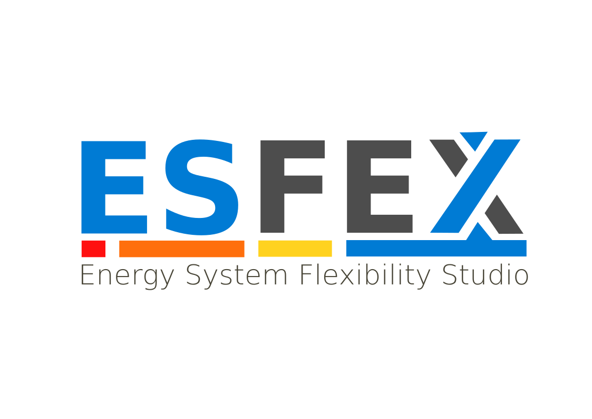

<div align="center">
  
</div>

# ESFEX

**Renewable Energy Flexibility — Power System Optimization Model**

ESFEX is an open-source power system planning framework that co-optimizes generation, storage, and transmission investment over multi-decade horizons while capturing the operational flexibility constraints that arise in systems with high shares of variable renewable energy. It couples a strategic capacity expansion planner (Master Problem) with a detailed operational dispatch engine through a two-stage decomposition, bridging the gap between long-term investment planning tools and short-term production cost models while explicitly addressing the epistemic uncertainity of the process.

The framework addresses a central challenge in energy transition planning: investment decisions must account for the flexibility needs of future systems — ramp rates, minimum stable generation, storage cycling, demand response, sector coupling — that simpler capacity screening tools ignore. ESFEX embeds these operational constraints directly into the planning process through representative-day validation in the Master Problem and full rolling-horizon dispatch for each year.

ESFEX is implemented as a hybrid Python/Julia system. Python handles configuration, data management, orchestration, the Studio, and post-processing; Julia (via JuMP) handles the mathematical optimization, leveraging its compiled performance for large-scale LP and MIP problems. The architecture is modular: seven interlinked optimization models (capacity expansion, operational dispatch, DC power flow, AC optimal power flow, primary energy supply chain, electrolyzer, and MGA/SPORES) can be selectively enabled depending on the study scope.

### Target Applications

- **Island power systems and isolated grids** transitioning from diesel dependence to high RE penetration
- **Regional transmission planning** with DC power flow, N-1 security, and transmission investment
- **Sector coupling studies** combining electricity, hydrogen (electrolyzer), fuel logistics (primary energy), and electric vehicles (V2G)
- **Policy analysis** evaluating RE targets, CO₂ budgets, storage mandates, and technology cost trajectories
- **Near-optimal space exploration** via MGA (Hop-Skip-Jump) or SPORES (per-objective sweep) for identifying robust investment strategies under uncertainty
- **Academic research** in energy systems optimization, flexibility quantification, and capacity expansion methodology


---


## Key Features

### Optimization Architecture

- **Two-stage decomposition** — Master Problem (all years simultaneously, representative days, representative periods) + Operational Dispatch (year-by-year, rolling horizon, full year). Investment decisions are validated operationally before being accepted.
- **Rolling horizon dispatch** — Configurable overlapping time windows with boundary condition propagation (battery SOC, generator status) and automatic result stitching. Window size and overlap are user-defined parameters.
- **Three simulation modes** — `development` (LP, continuous commitment + investment), `economic_dispatch` (LP, fixed fleet), `unit_commitment` (MIP, binary startup/shutdown with min up/down times).
- **Units decommissioning planning** — Age-based retirement plus NPV based retirement, allows a flexible and effective planning of the phasing-out / retention of units inventory.

### Power System Modeling

- **DC power flow** — KCL/KVL constraints with cycle-based formulation for meshed networks [**[1]**](reference/bibliography.md#ref1), voltage angle variables, piecewise-linear loss approximation, and transmission investment.
- **AC optimal power flow** — Four ACOPF formulations selectable via `power_flow_mode`: SOC relaxation [**[2]**](reference/bibliography.md#ref2) (convex W-space), QC relaxation [**[3]**](reference/bibliography.md#ref3) (McCormick envelopes), Polar NLP (exact V-θ), and Rectangular NLP (exact e-f). All use Ipopt [**[4]**](reference/bibliography.md#ref4). Models voltage magnitudes, reactive power balance, apparent power line limits (`P² + Q² ≤ S²`), and reactive generation with configurable Q limits. See [AC OPF](formulation/ac-power-flow.md).
- **AC power flow verification** — Post-DC Newton-Raphson AC power flow for validating voltage profiles, reactive power flows, and actual transmission losses. Dual implementation: a native Julia solver (`transmission_ac.jl`) and a pandapower bridge (`pandapower_bridge.py`) for IEC 60909 short-circuit analysis. Detects voltage magnitude violations and line overloads not captured by the DC approximation.
- **N-1 security** — Automatic identification of critical contingencies; post-contingency flow redistribution constraints for both generation and transmission elements. Supports both DC and AC contingency analysis with automatic fallback.
- **Frequency stability** — Post-contingency frequency metrics via center-of-inertia (COI) model [**[5]**](reference/bibliography.md#ref5), [**[6]**](reference/bibliography.md#ref6): ROCOF, frequency nadir, and steady-state frequency. N-1 screening for all online generators with configurable protection thresholds.
- **Battery storage** — Cyclic SOC constraints (final SOC = initial SOC per day), charge/discharge efficiency, calendar and throughput degradation, power/energy co-optimization with duration bounds.
- **Flexible demand** — Multi-sector decomposition with criticality-weighted load shedding and intra-day temporal shifting for deferrable loads.

### Sector Coupling

ESFEX treats sector coupling as a first-class architectural principle, not a bolt-on extension. Any energy end-use — whether electrical, thermal, chemical, or kinetic — can be represented as a demand with its own temporal profile, criticality level, and coupling constraints to the power system. The generator, battery, and demand abstractions are generic enough to model arbitrary conversion technologies (power-to-X, X-to-power) as nodes in a unified optimization. This paradigm enables ESFEX to incorporate virtually any sector coupling pathway by defining the appropriate demand type, conversion efficiency, and balance constraints, without modifying the core formulation.

The currently implemented sector coupling modules are:

- **Electrolyzer (P2H₂)** — Power-to-hydrogen conversion with capacity investment, load-dependent efficiency, ramp rate constraints, and coupling to both the electrical balance and hydrogen demand. Hydrogen can satisfy non-electric demands (industrial feedstock, transport fuel, heating) or be stored for later reconversion.
- **Primary energy** — Multi-fuel supply chain: import nodes, storage tanks, transport links (pipelines/tankers) with capacity constraints, and coupling to generator fuel consumption. Models the full logistics from fuel procurement to generator combustion.
- **Electric vehicles** — multi method fleet adoption, multi-category vehicles (passenger, bus, truck, etc), time-of-day charging profiles, V2G bidirectional optimization. EVs couple the transport sector to the electrical grid as both flexible loads and distributed storage.
- **Rooftop solar** — Stochastic adoption model with behind-the-meter generation as negative demand, coupling distributed generation at the consumer level.
- **Flexible sectoral demand** — Multi-sector demand decomposition with sector-specific criticality and temporal flexibility. Deferrable loads (industrial processes, water heating, EV charging) can shift consumption in time, enabling demand-side participation in system balancing.

### Planning and Analysis

- **MGA and SPORES** [**[7]**](reference/bibliography.md#ref7), [**[8]**](reference/bibliography.md#ref8) — Two distinct methods for near-optimal alternative generation under a shared cost-slack envelope. MGA runs the classical Hop-Skip-Jump diversity loop; SPORES solves one alternative per *named objective* (minimum build, technology equity, regional equity, evolutionary distance). See the [tutorial](tutorials/mga.md) for the dual workflow.
- **Stochastic programming** [**[9]**](reference/bibliography.md#ref9), [**[10]**](reference/bibliography.md#ref10) — Scenario-based capacity expansion with probability-weighted costs, shared investment variables across scenarios (EVPI/VSS analysis).
- **Sobol sensitivity analysis** [**[11]**](reference/bibliography.md#ref11), [**[12]**](reference/bibliography.md#ref12) — Global sensitivity indices for quantifying how input parameter uncertainty (costs, demand growth, availability) propagates to investment decisions and system cost.
- **Progressive RE targets** — Linear interpolation from initial to target RE penetration with annual increment bounds. Constraint-based curtailment limits (not just penalty-based).

### Tools and Interface

- **GIS-based Studio** — PySide6 + Leaflet.js map for visually building power systems: place nodes, generators, batteries, transmission lines with polyline routing. Includes resource assessment wizards for solar rooftop, solar PV utility-scale, wind and OTEC availability profiles.
- **Plugin system** — Directory-based plugins with simulation lifecycle hooks, GUI integration, and Julia overlay modules for custom constraints.
- **CLI** — `esfex run`, `validate`, `export`, `editor`, `info` commands with Rich formatting and progress tracking.
- **HDF5 output** — Structured results with derived metrics (LCOE, VALLCOE, capacity factor) exportable to CSV, Excel, and JSON.


---


## Feature Comparison

| Feature | ESFEX | PyPSA | GenX | Calliope | TIMES | IRENA FlexTool | OSeMOSYS |
|---------|--------|-------|------|----------|-------|----------------|-----------|
| Capacity expansion | Yes | Yes | Yes | Yes | Yes | Yes | Yes |
| Operational dispatch (hourly) | Yes | Yes | Yes | Yes | Time slices | Yes | Time slices |
| Two-stage decomposition | Yes | No | No | No | No | No | No |
| Rolling horizon dispatch | Yes | Yes | No | Yes | No | Yes | No |
| DC power flow (KCL/KVL) | Yes | Yes | No | No | No | No | No |
| AC optimal power flow (ACOPF) | Yes | No* | No | No | No | No | No |
| AC power flow verification | Yes | Yes | No | No | No | No | No |
| Battery cyclic SOC | Yes | Yes | Yes | Yes | Simplified | Yes | Simplified |
| EV fleet modeling (V2G) | Yes | Limited | No | No | Yes | Limited | No |
| Primary energy supply chain | Yes | Limited | No | Limited | Yes | No | Partial |
| Electrolyzer / P2H₂ | Yes | Yes | Yes | Yes | Yes | Yes | Limited |
| Stochastic programming | Yes | Yes | No | No | Yes | Limited | No |
| N-1 security constraints | Yes | Yes | No | No | No | No | No |
| MGA / near-optimal alternatives | Yes (MGA + SPORES) | Yes (MGA only) | Yes (MGA only) | Yes (SPORES) | No | No | No |
| Sobol sensitivity analysis | Yes | No | No | No | No | No | No |
| GIS-based Studio | Yes | No | No | No | No | No | No |
| Multi-system interconnection | Yes | Yes | Yes | Yes | Yes | Limited | Limited |
| Plugin / extension system | Yes | No | No | No | No | No | No |
| Solver backend | JuMP | Linopy | JuMP | Pyomo | GAMS | HiGHS/GLPK | GLPK/CBC |
| Primary language | Python + Julia | Python | Julia | Python | GAMS | AMPL + Python | MathProg |
| License | Apache-2.0 | MIT | GPL-2.0 | Apache-2.0 | GPL-3.0 | LGPL-3.0 | Apache-2.0 |

*PyPSA performs an ACPF via Newton-Raphson, not a full ACOPF

**Notes:**

- **PyPSA** [**[13]**](reference/bibliography.md#ref13) (Python for Power System Analysis) is a widely used open-source framework. Version 1.0 (October 2025) added built-in stochastic programming, MGA (classical HSJ flavour), and security-constrained OPF. SPORES-style per-objective sweeps are not part of the core; users implement them externally if needed. Rolling horizon dispatch and DC power flow have been core features since earlier releases.
- **GenX** [**[14]**](reference/bibliography.md#ref14) (MIT) is a capacity expansion model using Julia/JuMP. It uses a transport/zonal transmission model (DC OPF is listed as in development). It includes MGA and Method of Morris sensitivity analysis, but not scenario-tree stochastic programming.
- **Calliope** [**[15]**](reference/bibliography.md#ref15) is the originator of the SPORES [**[7]**](reference/bibliography.md#ref7) methodology for exploring near-optimal solution spaces. Its operate mode provides rolling horizon dispatch. Version 0.7 introduced a YAML-based user-defined math extension system.
- **TIMES** [**[16]**](reference/bibliography.md#ref16) (The Integrated MARKAL-EFOM System) is the IEA-ETSAP reference model for long-term energy system analysis. It uses time slices (not chronological hourly resolution) and operates through the GAMS algebraic modeling system with VEDA as its data management front-end. The model code is open-source (GPL-3.0); the GAMS runtime is commercial.
- **IRENA FlexTool** [**[17]**](reference/bibliography.md#ref17) is designed for flexibility assessment in power systems with high RE penetration. The optimization model is formulated in AMPL; Spine Toolbox provides the workflow GUI. It supports rolling optimization windows and limited stochastic scenario branching.
- **OSeMOSYS** [**[18]**](reference/bibliography.md#ref18) is a long-term energy planning model using time slices. The canonical implementation is in GNU MathProg; alternative implementations exist in Python (Pyomo, PuLP) and GAMS.

All numbered references **[N]** link to the [full bibliography](reference/bibliography.md).


---


## Quick Start

```bash
# Install
pip install esfex

# Validate a configuration file
esfex validate -c my_system.yaml

# Run a simulation
esfex run -c my_system.yaml --years 25 --verbose

# Export results
esfex export -r results/output.h5 -f csv

# Launch the Studio
pip install "esfex[gui]"
esfex studio
```


---


## Python API

```python
from esfex import load_config
from esfex.runner import Orchestrator

config = load_config("my_system.yaml")
orchestrator = Orchestrator(config, output_dir="./results")
results = orchestrator.run(years=25)

for year in results:
    print(f"Year {year.year}: RE={year.re_penetration:.1%}, "
          f"Cost=${year.objective:,.0f}")
```


---


## Documentation

| Section | Description |
|---------|-------------|
| [Getting Started](getting-started/installation.md) | Installation, quickstart, architecture, core concepts |
| [Tutorials](tutorials/single-system.md) | Step-by-step guides: single-system, multi-node, EV, stochastic, sensitivity |
| [User Guide](user-guide/cli.md) | CLI, configuration, master problem, data formats, availability profiles |
| [GUI Editor](gui/overview.md) | Interactive map-based grid editor |
| [Mathematical Formulation](formulation/overview.md) | Master problem, dispatch, DC flow, AC OPF, primary energy, electrolyzer |
| [API Reference](api/index.md) | Python and Julia public API |
| [Reference](reference/config-reference.md) | Config fields, HDF5 schema, constraint catalog, glossary |
| [Bibliography](reference/bibliography.md) | Full list of cited references (Applied Energy style) |


---


## Version Information

| Property | Value |
|----------|-------|
| Current version | 0.1.0 (alpha) |
| Python support | 3.10, 3.11, 3.12 |
| Julia support | 1.9+ (via juliacall) |
| Default solver | HiGHS (open-source LP/MIP) |
| License | Apache-2.0 |
| Status | Active development |


---


## Citation

If you use ESFEX in academic work, please cite:

```bibtex
@software{esfex2026,
  title   = {ESFEX: Energy System FlEXibility — Power System Optimization},
  author  = {Soto Calvo, Manuel and Lee, Han Soo},
  year    = {2026},
  url     = {https://github.com/msotocalvo/ESFEX},
  license = {Apache-2.0},
  version = {0.1.0}
}
```


---


## License

Released under the [Apache License 2.0](https://www.apache.org/licenses/LICENSE-2.0).


---


## Contributing

See [Development Setup](contributing/development-setup.md) for the development environment. Bug reports and feature requests: GitHub issue tracker.
